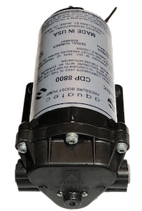
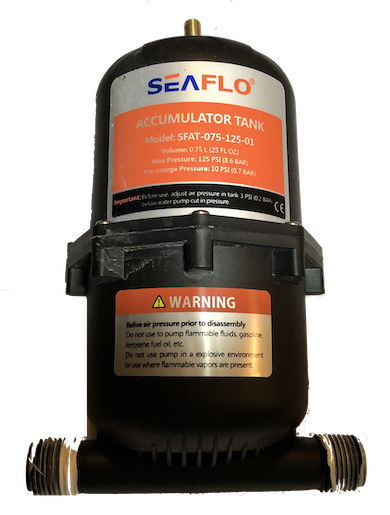
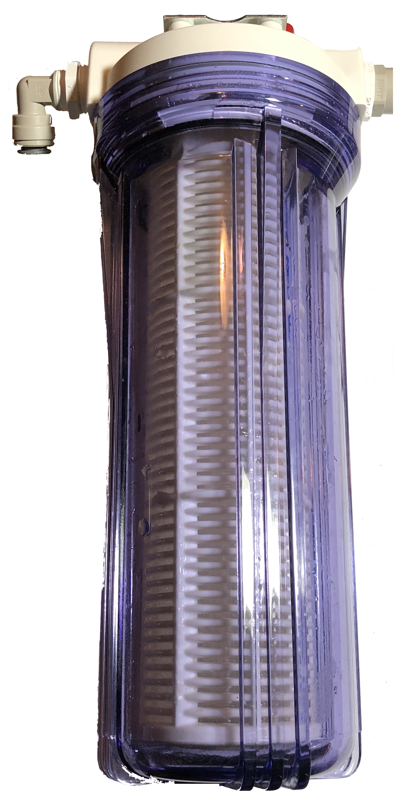

# TechnoTomato
## The Outdoor Aeroponic Tomato Growing System
TechnoTomato is a relatively large, complex, aeroponic project aimed at growing tomatoes aeroponically in an outdoor garden.  As such there are a number of challenges that had to be addressed. 

1. Outdoor environment is unpredictable.

   In a controlled indoor environment where you have predictable temperature, humidity and light you can use a simple system that has a fixed timing for spray cycles.  In an outdoor system where temperatures can range from mid fifties at night to over a hundred ℉ during the day and light can range from bright direct sun on a cloudless day to overcast and raining you need a much better system for controlling spray timing.
2. A whole bunch of different types of tomato plants that have unique needs

   I only have Jersey Devil and Brandywine tomatoes in the system now but there are many dozens of tomato strains.  Jersey Devil and Brandywine have much different leafs; the Jersey Devil has a thin whispy leaf while the Brandywine has a thicker potato leaf.  These two plants handle water stress differently; one wilts much more quickly than the other.  
3. Logging to a ThingSpeak channel while doing everything else
   
   In amongst reading sensors for three or four plants, controlling the valves for those plants, reading ambient air temperature and humidity and root temperature we are also sending data for each plant to a ThingSpeak channel once a minute.

These challenges have led to a combination of hardware and software innovations including a spray system that is easy to replace if it gets clogged, a burried root chamber that stays cool, a more or less modular control board and fully asynchronous, object oriented, state driven Arduino sketch.
### The Spray System
The heart of TechnoTomato is the nutrient delivery system and the Arduino that controls spray timing.  Everything else is just supporting this main function.
#### The Plumbing
##### Major Parts:
For a high pressure aeroponic system like TechnoTomato you need components that will operate at about 100psi.  The primary components in the system are a high pressure pump like the Aquatech shown here, a pressure switch that will turn the pump off at 100psi and an accumulator. For a high pressure system it is advisable to use press fit tubing and connectors because they wont pop loose like the barb connectors do at high pressure.

| Image | Description |
| --- | --- |
|  | 100psi Aquatech pressure pump |
|  | Pressure Switch:  100psi pressure switch for Aquatech pressure pump.  This ensures that pump actually turns off at desired pressure. |
|  | Accumulator:  The accumulator prevents the pump from constantly turning on and off by providing a compressable volume of air that will provide a buffer. |
|  | Filter:  I use a one micron filter on the TechnoTomato System to prevent small debris from clogging the spray nozzles. One micron is probably over kill, fifty would probably do fine for this purpose.  It is also advisable to put a course filter on the inlet side of the pump to prevent any bit bits of stuff from getting in. |
|  | Solenoid Valve:  These are a relatively cheap 12v solenoid valves  with a 1/4" press fit connector on the inlet and outlet. |
|  | Spray Nozzle:  The spray nozzles themselves are a pretty  standard 0.012” Orifice (0.3 mm) 10/24 UNC  brass outdoor misting nozzle which can be  had for $10 to $15 for a pack of 32.  With the press fit tee they are quite a  bit more expensive but the brass nozzle  can be taken out of the tee and replaced if it clogs. |
##### Other Parts: 
In addition to the major parts like pump, filter valves etc. you will also need tees, elbows, end caps and reducing couplings to go from 3/8" to 1/4".  

| Image | Description |
| --- | --- |
|  | 3/8" to 1/4" reducing coupling |
|  | 1/4" Press Fit Elbow |
|  | 1/4" Press Fit Tee |
|  | 1/4" Press Fit end cap |

#### The Controller

