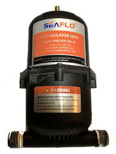
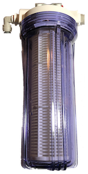

# TechnoTomato
## The Outdoor Aeroponic Tomato Growing System
TechnoTomato is a relatively large, complex, aeroponic project aimed at growing tomatoes aeroponically in an outdoor garden.  As such there are a number of challenges that had to be addressed. 

1. Outdoor environment is unpredictable.

   In a controlled indoor environment where you have predictable temperature, humidity and light you can use a simple system that has a fixed timing for spray cycles.  In an outdoor system where temperatures can range from mid fifties at night to over a hundred ℉ during the day and light can range from bright direct sun on a cloudless day to overcast and raining you need a much better system for controlling spray timing.
2. A whole bunch of different types of tomato plants that have unique needs

   I only have Jersey Devil and Brandywine tomatoes in the system now but there are many dozens of tomato strains.  Jersey Devil and Brandywine have much different leafs; the Jersey Devil has a thin whispy leaf while the Brandywine has a thicker potato leaf.  These two plants handle water stress differently; one wilts much more quickly than the other.  
3. Logging to a ThingSpeak channel while doing everything else
   
   In amongst reading sensors for three or four plants, controlling the valves for those plants, reading ambient air temperature and humidity and root temperature we are also sending data for each plant to a ThingSpeak channel once a minute.

These challenges have led to a combination of hardware and software innovations including a spray system that is easy to replace if it gets clogged, a burried root chamber that stays cool, a more or less modular control board and fully asynchronous, object oriented, state driven Arduino sketch.
### The Spray System
The heart of TechnoTomato is the nutrient delivery system and the Arduino that controls spray timing.  Everything else is just supporting this main function.
#### The Plumbing
##### Major Parts:
For a high pressure aeroponic system like TechnoTomato you need components that will operate at about 100psi.  The primary components in the system are a high pressure pump like the Aquatech shown here, a pressure switch that will turn the pump off at 100psi and an accumulator. For a high pressure system it is advisable to use press fit tubing and connectors because they wont pop loose like the barb connectors do at high pressure.

| Image | Description |
| --- | --- |
|  | **Pressure Pump:**  I am using a 100psi Aquatech pressure pump.  These are commonly used for RO systems in homes and RV's so they are readily available ane fairly cheap. |
|  | **Pressure Switch:**  100psi pressure switch for Aquatech pressure pump.  This ensures that pump actually turns off at desired pressure. |
|  | **Accumulator:**  The accumulator prevents the pump from constantly turning on and off by providing a compressable volume of air that will provide a buffer. |
|  | **Filter:**  I use a one micron filter on the TechnoTomato System to prevent small debris from clogging the spray nozzles. One micron is probably over kill, fifty would probably do fine for this purpose.  It is also advisable to put a course filter on the inlet side of the pump to prevent any bit bits of stuff from getting in. |
|  | **Solenoid Valve:**  These are a relatively cheap 12v solenoid valves with a 1/4" press fit connector on the inlet and outlet.  These valves and the relays that drive them are the weak link in the system.  It's important to spend the money on a solid state relay that can cycle millions of times but the valve is still electro-mechanical and will wear out over time.  Buys extras. |
|  | **Spray Nozzle:**  The spray nozzles themselves are a pretty standard 0.012” Orifice (0.3 mm) 10/24 UNC brass outdoor misting nozzle which can be had for $10 to $15 for a pack of 32. With the press fit tee they are quite a bit more expensive but the brass nozzle can be taken out of the tee and replaced if it clogs.  I have used a more expensive direct impingement type nozzle that has more throughput but for the type of "pulsed" system I am using these seem best. |
##### Other Parts: 
In addition to the major parts like pump, filter valves etc. you will also need tees, elbows, end caps and reducing couplings to go from 3/8" to 1/4".  

| Image | Description |
| --- | --- |
|  | 3/8" to 1/4" reducing coupling |
|  | 1/4" Press Fit Elbow |
|  | 1/4" Press Fit Tee |
|  | 1/4" Press Fit end cap |

#### The Controller
The controller and it's code are really the guts of the whole system.  The controller reads temperature sensors and leaf sensors over the I2C connection, executes code to decide how frequently to trigger spray cycles and, oh yeah, send data to thing speak now and then.
##### Major Parts:
| Image | Description |
| --- | --- |
|  | **Arduino Uno:**  I am using a standard issue Arduino Uno that I purchased through Amazon.  This is ok although if I did much more in the controller sketch memory could become an issue. |
|  | **ADC:**  I decided to use a 16 bit, 4 channel ADC in order to better resolve the analog input from the leaf sensors.  The leaf sensors have a range of voltages that have a difference of only 50 mv between low values for a fully hydrated leaf and a wilted leaf.  The 10 bit adc on the arduino will resolve this but it pretty coarse so I'm using an external 16 bit instead. |
|  | **Temperature Sensor:**  I happened to have a couple of BME680 temperature sensors from another project so I decided to use them instead of something cheaper. The BME680 is really overkill for this but it does have good accuracy and resolution.|
|  | **Relay:**  It's always necessary to use a relay for turning things like solenoid valves on and off.  The valves I'm using are 12v x .25 amp so I could probably use a power transistor but I like the fact that the signal side of the relay is separate from the power side. |
|  | **Relay:**  I'm using an ESP8266-01 to send logging data to the ThingSpeak channel for this set of plants.  I'll go into this in more detail when I publish the ThingSpeakPortal client sketch but the esp is a very simple, generic unit that listens for data in a json format on the serial port and then transmits it to thingspeak. |
|  | **Proto Board:**  Just a basic 1/2 sized solderable proto board for organizing all the connections. |
|  | **Leaf Sensor:**  Leaf sensor (on a Tomato leaf).  These leaf sensors from Agrihouse are a hall effect sensor that senses the thickness of whatever is between the two halves of the sensor clip.  Basically on one side of the plastic clip is a tiny magnet and the hall effect sensor on the other.  Most hall effect sensors have a linear distance to voltage ratio so I assume these do to.  I should probably test that theory some time but for now what I'm doing seems to be working. |
|  | **Assorted Bits'n'Bobs:**  Pictured are some plugs that can be soldered to the proto board but there are a variety of resistors, buttons etc that complete the controller. |
##### And all together now:
This is the whole thing put together in a box.

